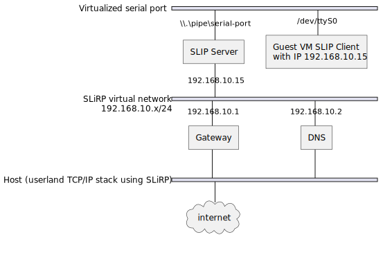

# slirp-slip-server

A SLiRP server to be used with VMs serial ports as SLIP connections.

Steps to use it and have a network connection in a VM via a serial port:

 - Run this application `./slirp-slip-server`
 - Configure your VM to use the pipe `\\.\pipe\serial-port` for its COM1
 - Start the VM
 - Once started, run these commands to get a SLIP connection up and running:
   - `slattach -p slip /dev/ttyS0`
   - `ifconfig sl0 192.168.10.15/24 mtu 1500 up && route add default gw 192.168.10.1 && echo 'nameserver 192.168.10.2' > /dev/resolv.conf`

The network is like this:

 - Virtual network: 192.168.10.0/24
 - SLIP Client (guest VM): 192.168.10.15
 - Host IP (gateway): 192.168.10.1
 - DNS Server IP: 192.168.10.2

MTU must be configured to 1500 else SLIP packets will be dropped randomly when larger than the (small) Linux default MTU for SLIP.



# Usage

Run `./ssh-agent-bridge.exe --help`:

```
Usage: D:\Projets_C-build\SlirpServer\vscode-x64-pc-windows-msvc-Debug\src\Debug\slirp-server.exe [options]
  --help                             Show this help
  --listen [<pipe>]                  Run in listen mode on given pipe
  --connect [<pipe>]                 Run in connect mode on given pipe
                                     (default mode)
  --disable-host-access              Disable access to host ports from guest
  --debug                            Show debug logs
  --forward <hostport>:<guestport>   Forward host port to guest (can be
                                     specified multiple times)
  --console                          Run with a console to show logs

Note: default pipe is \\.\pipe\serial-port
```

